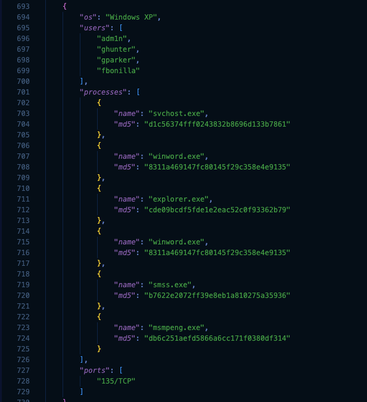
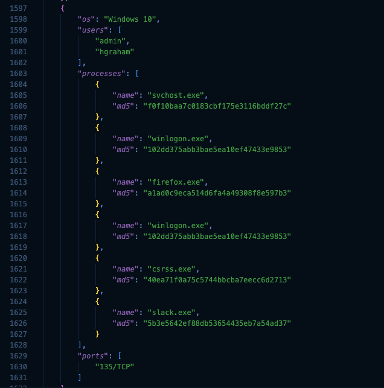
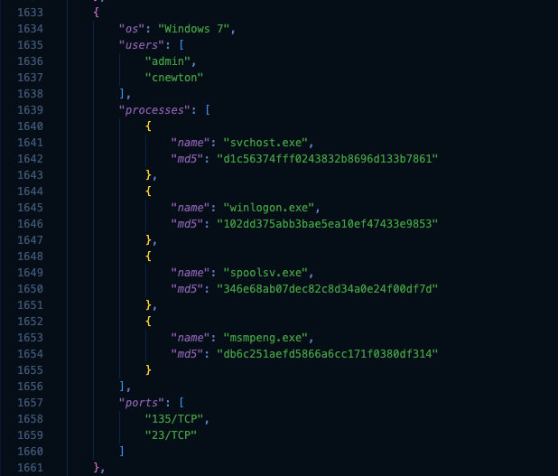

# Baselining Lab

## Overview

During a baselining operation conducted on a client network, simplified osquery data was collected from 50 workstations. The objective of this lab is to analyze the collected dataset and identify anomalous artifacts that deviate from the established baseline.

**Objective:** Identify and document 3 suspicious artifacts within `osquery.json`.

**Constraints:**
- The MD5 hashes present in the dataset are generated from process names.
- No cross-referencing with OS-specific process lists is required.

---

## Methodology

Baselining relies on the principle that anomalies are defined relative to a norm. The dataset was partitioned into three analytical categories > users, processes, and network ports. Each was examined for deviations from the patterns established across the 50 workstations.

| Category | Method |
|----------|--------|
| Users | Manual scan for deviations from the standard naming convention (first initial + last name) |
| Processes | Text search (`Ctrl+F` / `Cmd+F`) to locate MD5 hash inconsistencies across identical process names |
| Ports | Identification of the common listening port across all workstations, then flagging of any outlier |

---

## Findings

### Finding 1 > Account Manipulation: Non-standard Username `adm1n`

**Location:** Line 696  
**Workstation OS:** Windows XP  
**Local accounts:** `adm1n`, `ghunter`, `gparker`, `fbonilla`

The username `adm1n` employs a leetspeak substitution >> replacing the letter `i` with the digit `1` to impersonate a legitimate administrator account. All other workstations in the dataset follow a consistent naming convention of first initial followed by last name (e.g., `hgraham`). The use of `adm1n` is a known persistence technique designed to blend into standard account listings while maintaining unauthorized access.

---

### Finding 2 > Process Integrity Violation: Anomalous MD5 Hash for `svchost.exe`

**Location:** Line 1606  
**Workstation OS:** Windows 10  
**Local accounts:** `admin`, `hgraham`

| | MD5 Hash |
|---|---|
| Expected value (all other workstations) | `d1c56374fff0243832b8696d133b7861` |
| Observed value (this workstation) | `f0f10baa7c0183cbf175e3116bddf27c` |

Given that the MD5 hashes in this dataset are derived from process names, a divergent hash for a process sharing the same name across all workstations indicates that the underlying binary has been modified or replaced. `svchost.exe` (Service Host Process) is a critical Windows system process and a frequent target for malware seeking to masquerade as a legitimate process. This constitutes a strong indicator of compromise.

---

### Finding 3 > Unauthorized Service Exposure: Port 23/TCP (Telnet)

**Location:** Line 1659  
**Workstation OS:** Windows 7  
**Local accounts:** `admin`, `cnewton`

Across all 50 workstations, the only consistently observed listening port is 135/TCP (Microsoft RPC). This workstation additionally exposes port 23/TCP.

| Port | Protocol | Status |
|------|----------|--------|
| 135/TCP | Microsoft RPC | Expected > present on all workstations |
| 23/TCP | Telnet | Anomalous > present on this workstation only |

Telnet is a legacy remote access protocol that transmits all data, including credentials, in plaintext. Its presence on an isolated workstation, absent from the remainder of the fleet, constitutes either a serious misconfiguration or an indicator of unauthorized remote access being facilitated on the host.

---

## Summary

| # | Artifact | Workstation OS | Category |
|---|----------|----------------|----------|
| 1 | Username `adm1n` | Windows XP | Account Manipulation / Persistence |
| 2 | Modified `svchost.exe` binary | Windows 10 | Process Tampering / Indicator of Compromise |
| 3 | Port 23/TCP (Telnet) exposed | Windows 7 | Unauthorized Service / Misconfiguration |

---

## Files

| File | Description |
|------|-------------|
| `osquery.json` | Raw osquery dataset collected from 50 client workstations |
| `screenshot1.png` | Evidence > Finding 1 |
| `screenshot2.png` | Evidence > Finding 2 |
| `screenshot3.png` | Evidence > Finding 3 |
